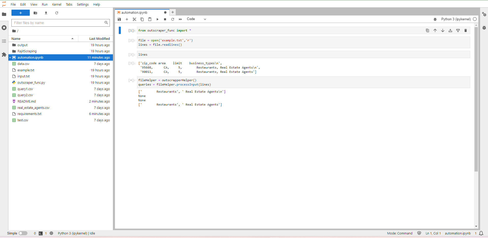

# Automation

We are automation the outscraper api call with different criteria


## Environment setup
#### step 1:
install mini-conda from the below according to the OS
[Mini-conda](https://docs.conda.io/en/latest/miniconda.htmlhttps://docs.conda.io/en/latest/miniconda.html)
#### step 2:
crate a new conda environment using the below command
```
conda create -n mining python=3.9.0

```
#### step 3:
activate the newly created environment using the below command

```
conda activate mining
```
#### step 4:
Go to the project directory where you have cloned the project from mini-conda terminal and enter below command 

```
pip install -r requirements.txt
```
#### step 5:
After installation process finished  enter this command into terminal
```
jupyter lab
```
You will get this type of UI in the browser and can easily run this code from there


## Input: 
We are using a text file as input which will contain 3 information

#### Look like this

| Zip code  | Area          | limit       | Business types |
| :-------- | :-------------| :-----------| :------------- |
| `integer` | `string`      |  `integer`  |  `string`      |

#### Process of API call
we are using outscrapper api for pulling data
```http
  GET https://api.app.outscraper.com/maps/search-v2
```
query pattern
```
  query = {
      "query": "restaurants, Manhattan, NY, USA",
      "dropDuplicates" : True,
      "limit": 200,
  }
```
#### Step 1
now we are we have developed a function which will call api for each Zip code and with different Business criteria.

#### Step 2
after getting the api response for each Zip code we making dataframe, Dropping the duplicates and finally we are merging all response for each zip. And saving dataframe as sheet
```
df.to_csv("data.csv",index=False)
```

#### Step 3
after this we are making another sheet for Useartemis with only those columns which are required for bulk searching
